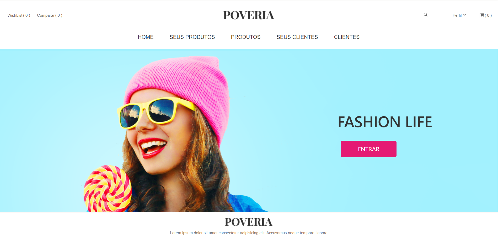

<h1 align="center">
    Cadastro de Produtos Hiring Coders
</h1>


<p align="center">
  
  
  <a href="https://github.com/Criptograma-1/Cadastro-e-commerce/commits/master">
    
  </a>
    
 </p>
 

<h4 align="center"> 
	🚧  Cadastro E-commerce | Hiring Coders 🚀 Concluido 🚧
</h4>




## 💻 Sobre o projeto

Site de cadastramento para e-commerce Desafio 2# - Gestão de Cadastros.

O desafio:
- Criação de um sistema e-commerce para inventário de produtos e dados de clientes.

Requisitos do desafio:
- Os dados de clientes, endereços e produtos devem estar devidamente estruturados;
- Dados no localstorage;
 -Código fonte no github com o arquivo README detalhando as funcionalidades da programação.


Projeto desenvolvido durante o treinamento [**Hiring Coders #2**](https://www.hiringcoders.com.br/) oferecida pela [VTEX](https://vtex.com/br-pt/) em parceria com a [Gama Academy](https://www.gama.academy/).
O Hiring Coders é um programa de capacitação gratuito e sem pré-requisitos, feito para todos que querem uma carreira à prova do futuro.

### [Teste o site](https://cadastro-e-commerce.vercel.app/)


## ⚙️ Funcionalidades

- [x] Página Home
  - [x] Botão de entrar que leva a página de Login
- [x] Página Login
  - [x] Fomulário com entrada para email e senha do funcionário
- [x] Página Seus Produtos
  - [x] Exibe os produtos já cadastrados
  - [x] Botão de cadastrar novos produtos
  - [x] Botão de remover produtos cadastrados
- [x] Página Produtos
  - [x] Formulário para cadastrar produtos
  - [x] Dados: nome, preço e preço de promoção, descrição, quantidade em estoque, categoria e foto.
  - [X] Dados armazenados no localstorage e exibidos na página "Seus Produtos"
- [x] Página Seus Clientes
  - [x] Exibe os clientes já cadastrados
  - [x] Botão de cadastrar novos clientes
  - [x] Botão de remover clientes cadastrados
- [x] Página Clientes
  - [x] Formulário para cadastrar clientes
  - [x] Dados: nome, telefone, endereço, email e foto.
  - [X] Dados armazenados no localstorage e exibidos na página "Seus Clientes"
- [x] Barra de navegação com link das páginas
- [x] Hospedagem no Vercel


## 🛠 Tecnologias

As seguintes ferramentas/linguagens foram usadas na construção do projeto:

- Javascript
- CSS
- React
- React-Router-DOM
- Styled-Components
- React-icons

Para mais informações leia o arquivo package.json

### 🎲 Configurando e rodando a aplicação

```bash

# Clone este repositório
$ git clone git@github.com:Criptograma-1/Cadastro-e-commerce.git

# Instale as dependências
$ yarn install

# Inicie a aplicação
$ yarn start

```

## 🦸 Autora

<a href="https://app.rocketseat.com.br/me/andresa-cristina-01103">
 
 <br />

 [](https://www.linkedin.com/in/andresa-cristina/) 
[](mailto:andresa.info@gmail.com)

---

## 📝 Licença

Este projeto esta sobe a licença [MIT](./LICENSE).

Feito com ❤️ por Criptograma 👋🏽 [Entre em contato!](https://www.linkedin.com/in/andresa-cristina/)

---
